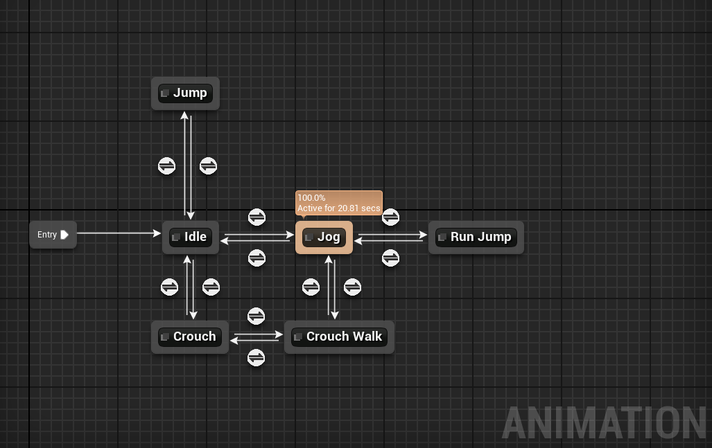
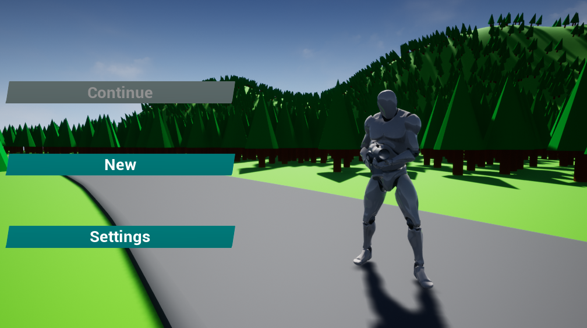

Informatik-Projekt von Jakob Wagner und Nick Lamprecht    
12g - 19/20 Stormarnschule Ahrensburg


## Umsetzung

Anstatt für unser Projekt von Grund auf anzufangen, verwenden wir eine Game-Engine. Engines gibt es für 2D und 3D-Spiele und bieten in der Regel bereits die Implementierung einer oder mehrerer Rendering-Schnittstellen wie OpenGL oder DirectX, ein Sound- und ein Physiksystem. Darüberhinaus haben Engines, wenn man sie mit einer Objektorientierten Sprache verwenden kann, bereits eine vergleichsweise ausgefeilte Struktur an Klassen, die man dann für seine Projekte verwenden und erweitern kann.

Wir verwenden die [UnrealEngine 4](https://www.unrealengine.com/en-US/what-is-unreal-engine-4) (in der Version 4.23). Man kann die Gameplayprogrammierung in C++ und der visuellen Programmiersprache der Blueprints durchführen. Beides lässt sich dabei ergänzend verwenden. Darüberhinaus lassen sich Skripte für die Verwendung innerhalb des Editors in Blueprints und Python schreiben.

<details>

<summary>Mehr dazu hier</summary>

Im folgenden Diagramm werden die Möglichkeiten der komplementären Verwendung von C++ und Blueprints dargestellt. Wie in Objektorientieren Sprachen üblich, kann jede Parent-Klasse unbegrenzt viele Child-Klassen haben kann.

    
*C++/Blueprint Relations*

## Blueprints
Blueprints verhalten sich im Prinzip wie die meisten anderen visuellen Programmiersprachen. Es gibt Code-Blöcke, die sogenannten Nodes, die sich mit dem Execution-Pin (weiß) verbinden lassen. Startpunkt für eine Node-Kette innerhalb eines Blueprint sind die Events, die entweder von anderen Blueprints, der Engine selbst oder einer C++-Klasse ausgelöst werden können. Jedes Event hat einen Execution Pin und kann zusätzlich über Input Values verfügen.
Außer dem Execution Pin kann man noch alle Output- und Input-Pins miteinander verbinden. Durch die verschiedenen Farben der Variablentypen[^1] lässt sich leicht die Übersicht behalten.
Darüberhinaus lassen sich wie in C++ eigene Variablen, Funktionen und Makros erstellen.   

    
*Beispielhafter einfacher Blueprint-Graph*   

### Sonderformen

Für gewisse Features der Engine gibt es eigene Blueprintformen. Teilweise muss dabei auf Blueprints zurückgegriffen werden und C++ ist keine Option. Diese Formen werden hier einmal dargestellt. 

#### Animation Blueprints

Animation Blueprints steuern die komplexeren Animationen für Skeletal Meshes. Man kann zwar auch einzelne Animationen mit C++ oder Blueprints abspielen lassen, aber Anstatt in einem normalen Blueprint Animationen einzeln abspielen zu lassen, können wir in einem Animation Blueprint komplexere Zusammenhänge zwischen Animationen herstellen und auch verschiedene Animationen parallel abspielen, also überblenden.
Dazu gibt es eine eigene Graph-Variante, in der man die verschiedenen Animation-States multilateral miteinander verbinden kann und zusätzlich die Bedingungen festlegen kann, wann die States gewechselt werden können.
Zudem können wir einige Eigenschaften der Animation an Variablen knüpfen, die Laufgeschwindigkeit des Spielers als Beispiel.   
    
*Ausschnitt aus dem Animation-Blueprint des SurvislandCharacters*

#### Material Blueprints

Material Blueprints werden dafür eingesetzt, um die Eigenschaften eines Materials zu bestimmen. Mithilfe von Materials kann man beeinflussen, wie die Engine Objekte rendert. 
Es sind nicht alle Nodes der Engine in einem Material Blueprint Graph vorhanden, sondern  nur eine kleinere Anzahl an Nodes, die sich ausschließlich um das Rendering drehen.   
    
*Unser Landscape-Material*

Material Blueprints haben eine ganz eigene Art von Child-Klassen: die sogenannten Material Instances. Die Instances besitzen keinen eigenen Graphen, sondern lediglich eine Oberfläche in der man die im Parent markierten Parameter verändern kann.
Der Vorteil der Verwendung von Material Instances liegt darin, dass sich alle Instances mit ihrem Parent einen einzigen Shader teilen und man somit weniger Arbeitsspeicher verbraucht. Darüber hinaus müssen wir nicht bei einer einzigen Farbänderung den Shader rekompilieren und können somit effizienter Arbeiten.   
     
*Unser Master-Material (links) und eine Material Instance für unser RoadTool (rechts)*

#### Widget Blueprints


Obwohl man in der UnrealEngine das User-Interface auch mit C++ und dem Slate-System programmieren könnte, wird im Regelfall auf die Widget-Blueprints zurückgegriffen. Auch hier lassen sich Parents (ohne Design) in C++ erstellen. Im Widget-Blueprint-Editor wird dann lediglich das Design mit dem UnrealMotionGraphics-System erstellt. Das hat den Vorteil, dass UI-Designer nicht programmieren können müssen. Das UMG-System eine große vorgefertigte Anzahl an Bedien- und Gestaltungselementen, die sich frei anordnen und gestalten lassen. Es lassen sich auch jederzeit neue Elemente erstellen.

## UnrealEngine 4 spezifisches C++
Im folgenden werden die neuen C++-Features der UnrealEngine beispielhaft erklärt, die für unseren Code relevant sind. So werden zum Teil nicht alle möglichen oder verwendeten Bezeicher aufgeführt. Eine vollständige Liste wird jedoch verlinkt.

### Makros

Alle folgenden Makros sind für das Reflection-System der Unreal Engine.
Das UnrealHeaderTool[^2] scannt alle Header-Dateien nach diesen Makros und generiert eine `.generated.h` für jede `.h`. Mithilfe dieser Header-Datei kann die Engine den Klassen, Funktion oder Variablen, die mit diesen Makros markiert sind, erweiterte Funktionen zur Verfügung stellen.
Für uns ist die Möglichkeit des Zugriffs auf in C++ deklarierten Variablen und Funktionen innnerhalb eines Blueprints am wichtigsten. Außerdem ist die Garbage Collection für uns von Bedeutung, da sie für uns ein Großteil des Memory-Managements abnimmt.

#### UPROPERTY

```c++
UPROPERTY(BlueprintReadWrite)
bool bIsBlueprintExposed;
```
Wir verwenden das `UPROPERTY`-Makro um für Variablen die Garbage-Collection zu aktivieren und damit wir diese in unseren Blueprints verwenden können. Mit weiteren Bezeichner kann das Verhalten der Variable zusätzlich spezifiziert werden. Wir verwenden am häufigsten die folgenden Bezeichner:
- `EditAnywhere`, das die Variable in einem Menü innerhalb der Engine verfügbar macht
- `BlueprintReadWrite`, das erlaubt die Variable in einem Blueprint zu modifizieren
- `BlueprintReadOnly`, das lediglich das Auslesen der Variable erlaubt

Eine vollständige Liste kann hier gefunden werden: https://docs.unrealengine.com/en-US/Programming/UnrealArchitecture/Reference/Properties/#propertyspecifiers   
Zusätzlich gibt es für `UPROPERTYs` Bezeichner für Metadaten: https://docs.unrealengine.com/en-US/Programming/UnrealArchitecture/Reference/Properties/#metadataspecifiers

#### UFUNCTION

```c++
UFUNCTION(BlueprintPure)
int32 GenerateSomeInt();

UFUNCTION(BlueprintCallble)
void SomeCalculations(int32 SomeInputInteger);
```
Mit dem `UFUNCTION`-Makro lassen sich in C++ deklariert & definierte Funktion in Blueprints aufrufen. `BlueprintPure` und `BlueprintCallabe` bestimmen hierbei um welche Art von Node es sich im Blueprint handelt.
Alle weiteren Bezeichner lassen sich hier finden: https://docs.unrealengine.com/en-US/Programming/UnrealArchitecture/Reference/Functions/#functionspecifiers   
Auch für `UFUNCTIONs` gibt es Metadaten-Bezeichner: https://docs.unrealengine.com/en-US/Programming/UnrealArchitecture/Reference/Functions/#metadataspecifiers   


#### USTRUCT

```c++
USTRUCT(BlueprintType)
struct FMyStruct
{
  GENERATED_BODY()
  ...
};
```
Das `USTRUCT`-Makro wird für Structs verwendet, die wir innerhalb der Engine verwenden wollen. Im Gegensatz zu den bisherigen Makros gibt es hier nur eine sehr begrenzte Anzahl an möglichen Bezeichnern, von denen wir lediglich einen verwende: `BlueprintType` macht das Struct in Blueprints verfügbar. 


#### UENUM

```c++
UENUM(BlueprintType)
enum class EMyEnum : uint8
{
  Case1 UMETA(DisplayName="Case2"),
  Case2,
  Case3
};
```
Ähnlich wie beim `USTRUCT`-Makro sorgt das `BlueprintType` für die Verfügbarkeit in Blueprints. Durch `UMETA` lassen sich zusätzlich Metadaten für die einzelnen Enumeinträge setzen, in diesem Fall ein anderer Anzeigename.  
Hier gibt es eine vollständige Liste an Möglichkeiten: https://docs.unrealengine.com/en-US/Programming/UnrealArchitecture/Reference/Metadata/#enummetadataspecifiers


#### UCLASS

```c++
UCLASS(Blueprintable)
class UMyClass : public UObject
{
  GENERATED_BODY()
  ...
};
```
Die meisten Eigenschaften der anderen Makros gelten auch hier. Das `Blueprintable` erlaubt es der Klasse eigene BlueprintChilds zu haben.

Alle Bezeichner: https://docs.unrealengine.com/en-US/Programming/UnrealArchitecture/Reference/Classes/Specifiers/index.html

Alle Bezeichner für Metadaten: https://docs.unrealengine.com/en-US/Programming/UnrealArchitecture/Reference/Classes/Specifiers/#metadataspecifiers

#### GENERATED_BODY()

Wie auch in einigen der oberen Beispiele schon gezeigt wurde, gibt es noch ein `GENERATED_BODY`-Makro. Dieses fügt lediglich von der Engine vorgegebenen Standardcode ein.

### Build.cs & Target.cs Dateien

Die UnrealEngine ist modular aufgebaut. Das heißt, dass der Code in viele verschiedene Teilbereiche aufgeteilt ist. Jedes Spiel oder auch Plugin, das in bzw. für die UnrealEngine erstellt wird, kann ebenfalls mehrere Module enthalten. Jedes Modul braucht eine eigene Build.cs-Datei für das UnrealBuildTool[^3].
In diesen Build.cs-Dateien werden sowohl die Ordner, die zum Modul gehören, aufgelistet, als auch die Abhängigkeiten des Moduls von anderen Modulen aufgeführt, damit später die richtigen DLLs und Moduldateien vom Compiler verlinkt werden können.
Wir verwenden allerdings nur ein einziges Modul in unserem Projekt, importieren dafür einige Funktionen aus Engine-Modulen. [Hier ist die Build.cs von unserem Survisland-Modul.](https://gitlab.com/f2p-entertainment/other/informatik-projekte/informatik-projekt-1/blob/f29d269df3466cdb0bf1bca71eb5405a06eef39f/Source/Survisland/Survisland.Build.cs)

Mit den Target.cs Dateien wird beschrieben welche Module für welche Plattform in welcher Konfiguration verfügbar gemacht bzw. verwendet werden sollen.
Wir benötigen lediglich die Standardkonfiguration, da wir keinen plattformabhängigen oder plattformspezifischen Code geschrieben haben.
Hier sind die Target.cs-Dateien für Survisland:  
- [Survisland.Target.cs](https://gitlab.com/f2p-entertainment/other/informatik-projekte/informatik-projekt-1/blob/f29d269df3466cdb0bf1bca71eb5405a06eef39f/Source/Survisland.Target.cs)
- [SurvislandEditor.Target.cs](https://gitlab.com/f2p-entertainment/other/informatik-projekte/informatik-projekt-1/blob/f29d269df3466cdb0bf1bca71eb5405a06eef39f/Source/SurvislandEditor.Target.cs)

-----

</details>

Die Engine ist dabei auch eine eigene Entwicklungsumgebung für Blueprints. Für die Entwicklung mit C++ muss noch auf eine alternative Entwicklungsumgebung zurückgegriffen werden. Wir verwenden dafür [VisualStudio Code](https://code.visualstudio.com) mit einigen Erweiterungen, die die Entwicklung in C++ erst ermöglichen:
- [C/C++](https://marketplace.visualstudio.com/items?itemName=ms-vscode.cpptools)
- [C#](https://marketplace.visualstudio.com/items?itemName=ms-vscode.csharp) [(für die Build.cs Dateien)](#buildcs-targetcs-dateien)
- [C++ Intellisense](https://marketplace.visualstudio.com/items?itemName=austin.code-gnu-global)

    
*Visual Studio Code mit der geöffneten [BuildingSpawner.cpp](Source/Survisland/Decoration/BuildingSpawner.cpp)*   


#### Plugins

Wir verwenden für unser Projekt zwei Plugins:   

1. Das [Save Extension Plugin](https://www.unrealengine.com/marketplace/en-US/slug/save-extension) von Piperift. Das Plugin verwendet das Serialization-System der Engine um alle Werte, die in einem konfigurierbaren Preset eingestellt wurden, automatisch abzuspeichern. Aufgrund der Größe der Map und der großen Anzahl an Objekten und Variablen bietet sich die Verwendung eines solchen Systems an.

   
*Unser Save-Preset in der UnrealEngine*   

2. Das [Modular Snap System](https://www.unrealengine.com/marketplace/en-US/slug/modular-snap-system) Plugin von Inu Games. Mit diesem Plugin lassen sich Static Meshes mithilfe von Sockets und Splines mit ihren Spline-Points aneinander heften. Das ist deshalb hilfreich, weil das Snapping-System der UnrealEngine auf dem (für den Spieler unsichtbaren) Gitternetz basiert, das die Spielwelt durchzieht. 

TODO: Transform Grafik Spline Snapping

### 3D-Modellierung
Für Modelle, die wir nicht innerhalb der Engine mit C++ oder Geometry-Brushes erstellen, verwenden wir [3ds Max von Autodesk](https://www.autodesk.de/products/3ds-max/overview). 3ds Max ist ein vergleichsweise komplexes 3D-Modellierungs- und Animationsprogramm. Für die simplen Modelle, die wir in unserem Spiel verwenden, brauchen wir lediglich die Polygonmodellierung. In unserem Fall reicht es, wenn wir mehrere einfache Körper (z.B. Quader) miteinander verbinden.

   
*3ds Max mit den Meshes für den BuildingSpawner*   

## Das Spiel

## Spielprinzip

Wie in fast allen Survival-Games geht es auch in Survisland darum sich in der Umgebung der Spielwelt Ressourcen bzw. Items zu sammeln, die es dem Spieler erlauben natürliche Gefahren wie Hunger und Durst als auch artifizielle Bedrohungen in Form von NPCs zu überwinden.

Alles funktioniert hierbei in festen Intervallen:   
- Jede Sekunde wird dem Spieler 0.2 Essens- und Trinkpunkte abgezogen   
- Alle 20 Minuten werden neue Items gespawnt    
- Nach 5 Minuten werden neue NPCs gespawnt    

Die Werte sind hier beispielhaft und werden sich im Laufe der Entwicklung noch häufig ändern.

## Spielablauf

Wenn das Spiel gestartet wird, öffnet sich zuallererst ein kleines Level, in dem sich der Spieler selbst nicht bewegen darf. Es dient lediglich dazu, dass wir einen abgeschirmten Bereich haben, wo dem Spieler ein Menü angezeigt wird, in dem er die Grafikeinstellungen anpassen kann.

   
*Die linke Kamera ist die Spielfigur im Menü-Level*

   
*Das Hauptmenü*


Wird das Spiel nun gestartet, wird das eigentliche Level geladen. Wenn die Map fertig geladen ist, geht es direkt los:
Die Timer für Items, NPCs und Spielerwerte starten sofort. Nun kann der Spieler sich frei bewegen, um die Gegend zu erkunden und sich auf die Suche nach Items zu machen. Die meisten Items können in den Städten gefunden werden (s. [Konzepterläuterungen](Konzepterkl%C3%A4rung.md#regionen)). Standardmäßig spawnt der Spieler in der Nähe einer Stadt, damit er sich ein anfängliches Loadout zusammensammeln kann. Wenn die Items der Stadt gesammelt sind, muss sich der Spieler zur nächsten Stadt begeben, die gerade noch am Horizont über den Wäldern erkannt werden kann.

Sowohl auf dem Weg als auch in den Städten trifft der Spieler dabei auf NPCs. Alle NPCs sind ebenso wie der Spieler bewaffnet. Befindet sich der Spieler in Sichtweite, bricht der NPC sofort seinen aktuellen Plan ab und nimmt die Verfolgung auf. Sobald sich der NPC in Schussweite gebracht hat, feuert er auf den Spieler bis dieser entweder außer Reichweite ist, oder einer der beiden Duellanten keine Hitpoints mehr hat.
Wird der Spieler erschossen, wird die Map wieder zur Menü-Map geändert: Das Spiel ist vorbei.

## Spielfunktionen

### Die Map

Die eigentliche Spielfläche bzw. das Terrain haben wir mit dem Landscape-Tool der UnrealEngine erstellt ([mehr im Stundenblog](README.md#22-august)).  
Das Level `World` ist unsere Karte. Dieses Level ist aus kleineren Levels zusammengesetzt. Im Sublevel `Root` befindet sich die Skybox, die Lichtquellen und ein paar Post-Processing Effektquellen wie z.B. für den Nebel. `WaterPlate` enthält ein einzelnes planares Static-Mesh mit unserem Ozean-Material. `Root` und `WaterPlate` sind über den vollständigen Aufenthalt im `World`-Level geladen.
Die eigentliche Umgebung mit den Städten und Wäldern ist in 4 Level aufgeteilt haben, die wir `MM`, `MN`, `NM` und `NN` genannt haben.
Der erste Buchstabe ist der x-Index des Levels und der zweite der y-Index. Wir haben Buchstaben genommen um mit kürzeren Namen eine größere Map erstellen zu können (26² anstatt 10² Maps bei einem Index pro Achse). Darüber hinaus haben wir nicht bei `A` angefangen, damit wir ggf. noch Maps nach vorne einschieben können, ohne negative Indizes zu verwenden oder alle Sublevel umbenennen zu müssen.
Diese vier Sublevels sind alle etwa 1km² groß und werden abhängig von der Position des Spielers geladen. Befindet der Spieler sich an der markierten Position (rot) kann der schraffierte Bereich entladen werden und wir sparen so Ressourcen auf dem Computer des Nutzers.

   
*Die Minimap des WorldComposition-Tools*


### Spieler

In der UnrealEngine besteht ein Spieler aus zwei Objekten:
Dem Pawn, meist ein Skeletal-Mesh, er ist die (visuelle) Repräsentation des Spielers und dem (Player)-Controller, der im weitesten Sinne die Logik enthält.

Der Grund hierfür ist, dass ein Spieler in einem Spiel unterschiedliche Pawns haben kann, aber die eigentlichen Daten dieselben bleiben.
Beispiel:

Der Spieler startet als menschliche Figur in der Welt. Steigt er nun in ein Auto, würde der Controller den Pawn der Figur zurücklassen (und despawnen) und Beginnen das Auto zu steuern. Möchte der Spieler das Auto nach einer Weile wider verlassen, kann ein neuer Pawn gespawnt werden, den der Controller dann übernehmen kann.
So lässt sich Logik, die für den Spieler an sich bzw. das Spiel relevant sind (z.B. die Punktzahl) von Logik der Figur (z.B. Blinker und Licht an einem Auto) voneinander trennen.

Der Spieler kann sich natürlich innerhalb der Map bewegen. Diese Funktionalität ist nativer Teil des [ACharacter](https://docs.unrealengine.com/en-US/API/Runtime/Engine/GameFramework/ACharacter/index.html), einem Child des Pawns. Darüber hinaus haben wir die Funktion eingebaut, dass sich der Spieler Ducken kann. Die Animation dafür kommt aus dem [Animation Starter Pack](https://www.unrealengine.com/marketplace/en-US/slug/animation-starter-pack) von Epic Games, den Entwicklern der UnrealEngine.

#### Bedürfnisse

   
*Statusleisten des Spielers*

Der Spieler hat einen begrenzten Healthpool (rot) von 100 Hitpoints (HP). Sowohl Treffer durch gegnerische NPCs, als auch Hunger und Durst können dem Spieler HP abziehen.
Der Hunger (braun) und der Durst (blau) werden nur in einem festen Intervall größer und werden nicht durchs Gameplay beeinflusst. Die Anzeige ist hierbei allerdings die Sättigung und nicht der Hunger selber. Das heißt, dass der Statusbalken sich dem Nullpunkt nähert.
Wird ein Wert null, wird pro Sekunde 1 HP abgezogen. So werden dem Spieler maximal 2 HP pro Sekunde abgezogen, bis er Items einsetzt, um dies zu verhindern.

#### Inventar

   
*Das Inventar*

Der Spieler besitzt ein Inventar mit einem Maximalgewicht, das nicht überschritten werden kann. Dies haben wir mithilfe eines ActorComponents realisiert, der zu dem Character-Blueprints des Spielers hinzugefügt wird. Das Gewichtslimit wird in Grau als eigene Statusleiste angezeigt.

Die Items sind so lange sie in der Map sind ein eigener Actor mit einem Würfel als Modell. Die Farbe wird mit einer dynamischen Material-Instanz generiert, sodass jedes Item trotz des gleichen Modells auf Distanz schon erkannt werden kann.

|Item|Farbe|
|----|-----|
|Bandage|Rot|
|Wasser|Blau|
|Essen|Braun|

Darüber hinaus passen die Farben zu denen der Statusleiste des Spielers.

   
*Alle Items nebeneinander*

Um das Modell der Items befinden sich zwei unterschiedlich große Boxen. Die größere hat ein OnOverlap-Event, bei dem wir überprüfen, ob sich der Spieler innerhalb dieser Box befindet. Erst dann überprüfen wir ob der Spieler auch das Item bzw. die kleinere Box anschaut.
Da wird diese Sichtkontrolle über das Event Tick machen, also jeden Frame aufrufen, haben wir die Bedingung der Nähe gesetzt.
Bei etwa 120 Items auf ~1km² der eigentlichen bespielbaren Fläche ist die Wahrscheinlichkeit sehr hoch, dass sich der Spieler nur in der Nähe eines Items, wenn überhaupt, befindet. Bei einer Framerate von 30 FPS haben wir so 3570 unnötige Funktionsaufrufe gespart. Bei 60 FPS sind es etwa 7140.

    
*Ein Item mit sichtbaren Kollisionsboxen*

Die Kontrolle, ob der Spieler ein Item anschaut, ist dabei auch sehr simpel:
Wir nehmen den Richtungsvektor der Kamera des Spielers bzw. ein Vielfaches dieses Vektors und überprüfen, ob er die kleinere Box schneidet. Wenn dem so ist, erlauben wir dem Spieler die Funktion fürs Aufsammeln aufzurufen.

## KI-Gegner / NPC

   
*Zwei NPCs*

Bei unserer KI unterscheiden wir zwischen den Stadt-NPCs und den Wald NPCs:
- Stadt-Typ 1 steht dauerhaft innerhalb von Gebäuden
- Stadt-Typ 2 geht zwischen zufälligen Punkten einer Stadt hin und her
- Wald-Typ wandert hauptsächlich in den Wäldern bzw. auf den Straßen umher. Kann zufällig in eine Stadt oder ein Haus gelangen

Jeder NPC besteht dabei wie der Spieler aus einem Pawn, in diesem Fall auch ein Character, und einem Controller.
Jetzt handelt es sich allerdings um ein AI-Controller. Die Hauptlogik der KI wird mithilfe von den AI-Blackboards, einer Sonderform von Blueprints, festgelegt. Mit diesem Blueprint lassen sich verschiedene Zustände der KI festlegen und die Konditionen, die erfüllt sein müssen, um diese Zustände zu erreichen.


*Blackboard-Blueprint von Typ 2*

Die Hauptaufgabe für den KI-Typen 1 ist es, zu überprüfen, ob der Spieler sich in Sichtweite befindet. Wenn dies so ist, wird die Kondition CanSeePlayer gesetzt, sodass die KI nun in den Status der Verfolgung gelangen kann. Sie versucht jetzt den Spieler in Schussweite zubringen. Wenn dies gelingt, wird der Status zum Angriffsmodus geändert, in dem nur in einem festen Intervall auf den Spieler gefeuert wird.

   
*Der Spawner für Typ 2*   


Während der KI-Typ 1 noch von den Häusern selbst gespawnt wird, haben wir für Typ 2 einen Actor gebastelt, der das Spawnen übernimmt.
Damit das alles so funktioniert haben wir erst einen Actor erstellt, der CityWaypoint heißt. Die einzige relevante Variable dieses Actors ist die 'CityID'. Danach haben wir 4 Child-Klassen des CityWaypoints erstellt - für jede Stadt eine. In diesen haben wir dann die 'CityID' auf 0, 1, 2 bzw. 3 gesetzt. Anschließen haben wir an jeder Kreuzung in einer Stadt so einen CityWaypoint gesetzt.

In unserem AISpawner haben wir dann für jedes Objekt der Klasse CityWaypoint (das umfasst auch die Child-Klassen) einen neuen NPC spawnen lassen und anschließen den CityIndex im NPC auf Index des aktuellen CityWapoints gesetzt.

Jetzt können wir im NPC uns einen zufälligen CityWaypoint aussuchen, der in der Stadt liegt, in der auch der NPC gespawnt wurde. So sorgen wir dafür, dass sich immer eine hohe Anzahl an NPCs in einer Stadt befinden.

Bei Typ 3 bzw. dem Wald-Typ ist das ganze deutlich simpler: Er sucht sich einfach einen zufälligen Punkt im Radius, durch den der AI-Controller navigieren kann, und läuft dahin.

#### Wann hält ein AI-Controller einen Punkt für navigierbar?

Damit sich eine KI in einer Welt bewegen kann, muss ihr natürlich kommuniziert werden, wo sie sich bewegen darf. Das geschieht in der UnrealEngine, wie in vielen anderen Engines und Spielen auch, über ein NavMesh (Navigation-Mesh). Es ist eine Art unsichtbare Schicht, die über dem Boden des Levels liegt. Befinden sich hohe Objekte im Weg des NavMeshes, wird es um das Objekt herum generiert.
Befindet sich ein Punkt innerhalb dieses Meshes, ist er navigierbar.

Bei kleinen Maps ist das auch kein Problem: Die Berechnungen für ein kleines und statisches NavMesh gehen recht schnell. Allerdings ist unsere Map mit ihren 4km² vergleichsweise groß. Das würde für sehr lange Rechenzeiten sorgen. Darüberhinaus ist die Karte auch noch in 4 Kacheln aufgeteilt, die ggf. nicht alle parallel geladen sind. So müsste das Mesh beim Laden einer Kachel neu berechnet werden.

Deshalb verwenden wir NavigationInvokers. Die werden zum Pawn des NPCs hinzugefügt und generieren dynamisch ein NavMesh um den NPC herum.


## Kampfsystem

Obwohl Spieler und NPCs eine Waffe mit sich herumtragen, kommen diese nie zum Einsatz: Für das Kampfsystem verwenden wir Line-Traces (auch Raycasting / Raytracing), also eine einfache virtuelle Gerade zwischen zwei Punkten. Der Startpunkt ist bei uns entweder die Kamera des Spielers oder der Kopf eines NPCs. Endpunkt ist der Richtungsvektor der Kamera bzw. des Kopfes * 5000uu (UnrealUnits; 1uu = 1cm). Das ist unsere simulierte Reichweite der Waffe. Wir ziehen also bei jedem Schuss eine Gerade und schauen, ob die Gerade einen Gegener schneidet. Wenn dem so ist, wird das Damage-Event der UnrealEngine ausgelöst, das wir im Blueprint des Spielers und der NPCs implementiert haben.
Da wir keine Effekte oder ähnliches beim Schießen anzeigen, benutzen wir eine Option, die eigentlich zum Debuggen gedacht ist: Wir lassen uns die Line-Traces anzeigen. So bekommt der Spieler ein Trefferfeedback und kann auch nachvollziehen, wie er zum Beispiel von der KI getroffen wurde.

   
*Ein Kampf*   

## Weiteres 

TODO: Transform Grafik Spline Snapping

### Steuerung

|Taste|Aktion|
|-----|------|
|W|Vorwärts gehen|
|S|Rückwärts gehen|
|A|Nach Links gehen|
|D|Nach Rechts gehen|
|Leertaste|Springen|
|Strg|Ducken|
|Tab|Inventar öffnen/schließen|
|F|Item aufheben|
|Linke Maustaste|Schießen / Interaktion im Inventar|     

### Installation

*Umfasst lediglich die Installation der von uns kompilierten Versionen. Eine Anleitung zum kompilieren wird noch erstellt*

Survisland kann auf https://downloads.survisland.de/ runtergeladen werden.
Dort gibt es eine Liste mit allen Versionen und ggf. Hinweisen zu dieser Version.
Es gibt dabei an sich zwei Möglichkeiten:

- Game (Plattform)
- Patch (Plattform)

Game ist hierbei das komplette Spiel in der genannten Version und Patch ist lediglich ein .pak-Archiv mit den Änderungen eines Updates im Vergleich zur Vorgängerversion. Die Patches sind allerdings erst ab Version 0.2.0 verfügbar.

*Beispiel:*
0.1.0 Game + 0.1.1 Patch = 0.1.1 Game

   
*Die Download-Seite*   

*Tipp:* Mit https://downloads.survisland.de/latest/plattform kann stets die aktuellste Version des Spiels runtergeladen werden. 'plattform' muss hier mit dem passenden Kürzel ersetzt werden (s. Tabelle unten).

Der Download umfasst ein .zip-Archiv mit dem Namen 'Survisland-Version-Plattform'. Das kann einfach entpackt werden (z.B. mit dem Windows-Explorer). Im Ordner 'Survisland' befindet sich die 'Survisland.exe', über die das Spiel gestartet werden kann.

   
*Survisland.exe im Windows-Explorer*   
   
#### Plattformen

Derzeit ist Survisland nur für Windows verfügbar.

|Kürzel|Plattform|
|------|---------|
|win64|Windows (64-Bit)|
|win32|Windows (32-Bit)|

Versionen für Linux und Android werden wir nach der Abgabe noch hinzufügen (oder im zweiten Halbjahr ;))

### Updates / Patches

Der Download eines Patches umfasst ebenfalls ein .zip-Archiv. Der Name ist dabei lediglich 'Survisland-Version'. Im Archiv ist nur eine .pak-Datei, die in den Ordner 'Survisland\Content\Paks' entpackt werden kann.

## Das fertige Spiel

Zum Schluss noch ein paar Impressionen aus dem Spiel


---

[^1]: Blueprint Variables - UnrealEngine Documentation: https://docs.unrealengine.com/en-US/Engine/Blueprints/UserGuide/Variables/index.html
[^2]: UnrealHeaderTool - UnrealEngine Documentation: https://docs.unrealengine.com/en-US/Programming/BuildTools/UnrealHeaderTool/index.html
[^3]: UnrealBuildTool - UnrealEngine Documentation: https://docs.unrealengine.com/en-US/Programming/BuildTools/UnrealBuildTool/index.html