Auch verfügbar auf https://survisland.de/log


# Protokoll 'Survisland'

*Informatik-Projekt von Jakob Wagner und Nick Lamprecht*

## Vorwort

Hier befindet sich das Stundentagebuch zu unserem Projekt.
Eine Übersicht über die verwendete Software findet sich auf der [Projektseite](Projektseite.md).

Der Übersichtlichkeit wegen, haben wir hier nur ein paar Code-Beispiele genauer erklärt, um den Umgang mit UnrealEngine-Typen näherzubringen. Der meiste Code sollte verständlich genug geschrieben worden sein, dass nur knappe Kommentare innerhalb der .cpp-Dateien ausreichen sollten. Bei nicht sofort ersichtlichen Konzepten finden sich auch größere Kommentarblöcke, ggf. mit Links zur UnrealEngine Dokumentation, im Code (s. Beispiel). Kommentare in Header-Dateien sind primär für uns beim Entwickeln gedacht.

```c++
    ...
    /**
     * Settings for the renderer are applied as a console command. For this we get the current value and modify it
     * See https://docs.unrealengine.com/en-US/Programming/Development/Tools/ConsoleManager/index.html
     * for reference
    */
    IConsoleVariable* Variable = IConsoleManager::Get().FindConsoleVariable(*VariableName);
    if(Variable)
    {
    ...
```
*Beispiel für einen Kommentarblock | Aus [UGraphicSettings::UpdateIndex](https://gitlab.com/f2p-entertainment/other/informatik-projekte/informatik-projekt-1/blob/master/Source/Survisland/UI/GraphicSettings.cpp#L6)*

## Stundenlog

### August
<details>

<summary>Anzeigen</summary>

**13.August:**   
Zu Beginn haben wir uns erst einige Projekter der vergangenen Kurse angesehen. Anschließend haben wir diskutiert was für ein Projekt wir uns vorstellen könnten. Schlußendlich haben wir uns für ein Spiel, das in der UnrealEngine 4 erstellt werden soll, entschieden.

**14.August:**   
Als ersten Schritt haben wir das Repository auf Gitlab.com erstellt und dieses Protokoll angelegt.
Außerdem haben wir das eigentliche Projekt in der Unreal Engine erstellt und konfiguriert und zum Repository hinzugefügt.
Da die Blueprints und sonstige Inhalte der UnrealEngine als Binärdateien vorhanden sind, und man diese aufgrund seiner Funktionsweise nur schlecht mit git verwalten kann, verwenden wir die git-Erweiterung git LFS, die anstatt den großen Dateien selber, die es an einem separaten Ort speichert, nur eine Art von Textdatei ins Repository hinzufügt, die speichert um welche Version der Datei es sich handelt.

```
version https://git-lfs.github.com/spec/v1
oid sha256:8f8af25d267b4ee25437c6a993c8153a783364510835e777fadc5519cb267def
size 28114094
```
*Beispiel LFS-Pointer*

In der `.gitattributes` befindet sich die LFS-Konfiguration.

```
*.uasset filter=lfs diff=lfs merge=lfs -text
*.umap filter=lfs diff=lfs merge=lfs -text
*.mp4 filter=lfs diff=lfs merge=lfs -text
```
*Unsere [`.gitattributes`](https://gitlab.com/f2p-entertainment/other/informatik-projekte/survisland/survisland/blob/master/.gitattributes)*

Zusätzlich haben wir eine [modifizierte Version](https://gitlab.com/f2p-entertainment/other/informatik-projekte/informatik-projekt-1/blob/master/.gitignore) der [gängigen `.gitignore`](https://github.com/github/gitignore/blob/master/UnrealEngine.gitignore) für UnrealEngine-Projekte angelegt. Diese verhindert, dass aus Versehen ungewollte Dateien im Repository landen. Dies wäre zwar auch durch eine lokale Konfiguration des git-Clients möglich, allerdings wird die `.gitignore` ins Repository selbst hinzugefügt und so steht somit allen Nutzern des Repositories die  richtige Konfiguration zur Verfügung.

**15.August**   
Damit wir nicht ohne Plan und Ziel mit dem Arbeiten anfangen, haben wir begonnen ein recht einfach formuliertes Konzept zu formulieren. Wir haben dabei auch nach Features und Funktionen sortiert, die unser Spiel haben sollte, und welche, die es nur haben sollte. Letztere würden wir nur versuchen umzusetzen, wenn dazu noch Zeit wäre.

Wir haben uns also für ein Survival-Game entschieden, das sowohl in der Third- als auch First-Person-Sicht spielbar sein soll. Das vollständige Konzept ist hier zu finden: [Konzept.md](Konzept.md).
Genauere Hintergrundgedanken zu einigen Punkten sind im [Wiki](https://gitlab.com/f2p-entertainment/other/informatik-projekte/informatik-projekt-1/wikis/Konzepterkl%C3%A4rung) zu finden.


**20.August**    
Um nun mit dem Arbeiten zu Beginnen haben wir erst die [benötigten Anwendungen](Projektseite.md#Umsetzung) installiert und anschließend einige, noch leere, Basisklassen angelegt und die Map 'World' erstellt.
Darüberhinaus haben wir für Survisland eine eigene Log-Kategorie angelegt, die es uns vereinfachen soll, unseren Code zu debuggen.
Wir haben sie in der Hauptdatei unseres Survisland-Moduls erstellt, also der `Survisland.h` bzw. `Survisland.cpp`.
```c++
#pragma once

#include "CoreMinimal.h"

/** 'Survisland' is the name of the category, 'Log' the default verbosity and 'All' is the level of
 *  verbosity that will actually be compiled
 *  See https://docs.unrealengine.com/en-US/API/Runtime/Core/Logging/FLogCategoryBase/index.html
 *  and https://docs.unrealengine.com/en-US/API/Runtime/Core/Logging/ELogVerbosity__Type/index.html
 *  for reference */
DECLARE_LOG_CATEGORY_EXTERN(Survisland, Log, All);
```
*[Survisland.h](https://gitlab.com/f2p-entertainment/other/informatik-projekte/informatik-projekt-1/blob/master/Source/Survisland/Survisland.h)*

```c++
#include "Survisland.h"
 [...]
DEFINE_LOG_CATEGORY(Survisland);
```
*[Survisland.cpp](https://gitlab.com/f2p-entertainment/other/informatik-projekte/informatik-projekt-1/blob/master/Source/Survisland/Survisland.cpp)*

Wie in Standard-C++ wird in der `.h` deklariert und in der `.cpp` definiert.  
Nun können wir in jeder Klasse, die die `Survisland.h` importiert, wie folgt einen Eintrag im Log mit unserer eigenen Kategorie erstellen:
```c+++
 UE_LOG(Survisland, Log, TEXT("Text mit String Variable: %s"), *FString("Beispiel"));
```
Das sieht dann so aus:  
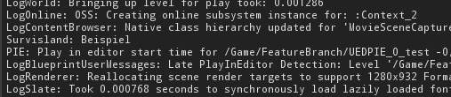  
*Ausschnitt aus dem Output Log-Fenster der Engine*   

**21. August**   
Heute haben wir uns eine Klasse erstellt, die einige nützliche Funktionen für Blueprints enthält, die `Survisland Blueprint Function Library` - kurz [`SurvislandBFL`](https://gitlab.com/f2p-entertainment/other/informatik-projekte/survisland/survisland/blob/master/Source/Survisland/SurvislandBFL.h).
So haben wir zum Beispiel eine Funktion, die uns erlaubt unsere `Survisland`-Log-Kategorie innerhalb von Blueprints zu verwenden.
Außerdem haben wir Funktionen erstellt, die uns häufige Aufrufe erleichtern.

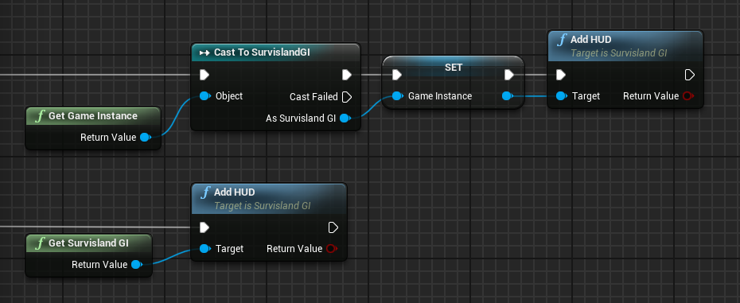   
*Die normale Prozeduren (oben) und über unsere Funktionen (unten)*   

**22. August**    
Heute haben wir mit der Ausgestaltung der Map begonnen. Wir verwenden das Landscape-Tool der UnrealEngine um das Gelände der Karte zu gestalten.
Mit diesem Tool können wir mit wenigen Mausklicks ein großes Terrain erstellen bzw. verändern.

   
*Das Landscape-Tool im Einsatz*   

Außerdem verwenden wir die [World-Composition-Tool](https://docs.unrealengine.com/en-US/Engine/LevelStreaming/WorldBrowser/index.html) der Engine. Mit diesem Tool lassen sich besser größere Spielwelten erstellen, da die eigentlichen Objekte in kleinere Level verteilt werden, die dann dynamisch geladen werden, wenn sich der Spieler in der Nähe befindet.

Auch das vorher erstellte Landscape wird geteilt. In unserem Fall teilen wir die Insel in 4 große Kacheln, die das Terrain und weitere Dekoration enthalten. Ein Sublevel enthält die Skybox und einige Lichtquellen.
Außerdem haben wir ein Sublevel für das Wasser des Ozeans angelegt.

**27. August**    
Heute haben wir uns um die Material-Blueprints für unser Projekt gekümmert. Zuerst haben wir ein Material für das Landscape angelegt.   
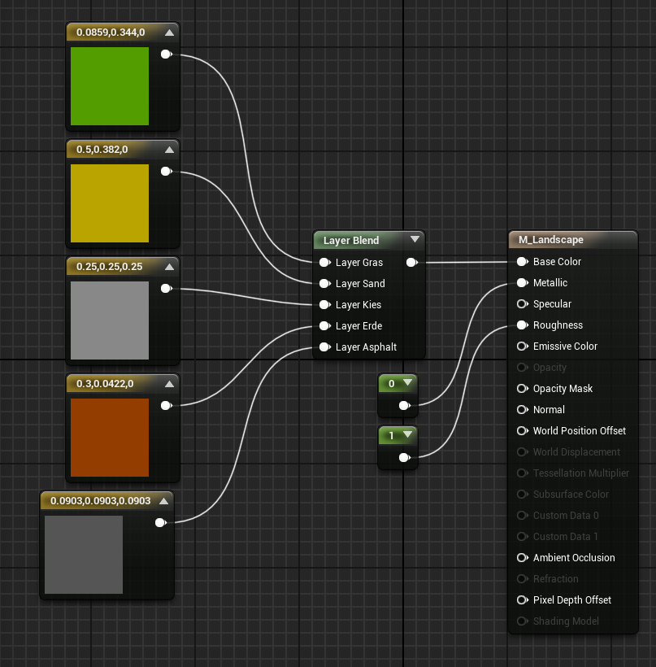   
*Das Landscape-Material*   
Es ist ein sehr simples Material, das lediglich ein paar verschiedene Farben enthält, die unterschiedliche Bodenarten wie Gras, Sand oder Asphalt darstellen sollen.
Mit der LandscapeLayerBlend-Node können wir die Farben im Prinzip übereinanderlegen. Zusätzlich geben wir den Namen an und welche Höhe der Layer haben soll. Dies könnte man auch an Berechnungen knüpfen, uns reicht allerdings das manuelle umstellen der Textur.

   
*Nun können wir kinderleicht unser Landscape einfärben*   

**28. August**    
Nach unserem Landscape-Material folgen nun die anderen Materials. Um Resourcen zu sparen, wollen wir für unser Projekt jediglich ein einziges Master-Material und anschließend mit Material Instances arbeiten.

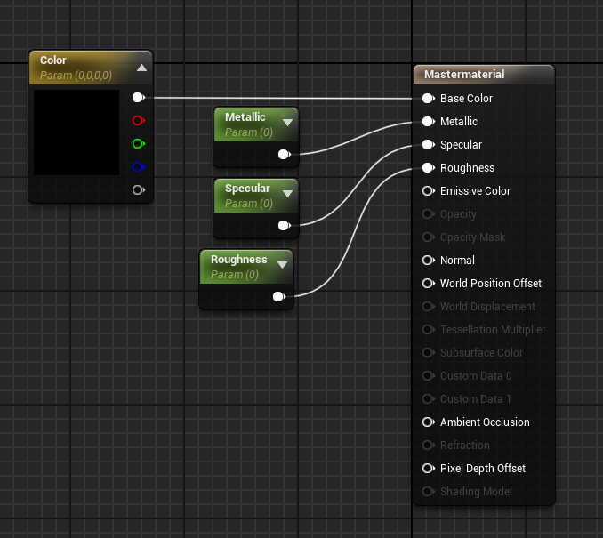   
*Unser Master-Material*   
Wir haben alle Eigenschaften eines Materials, die wir in unserem Projekt verändern müssen, zu Parametern erklärt. Das erlaubt uns später das Arbeiten mit sowohl festen Material-Instances als auch dynamischen Material-Instances.

**29. August**  
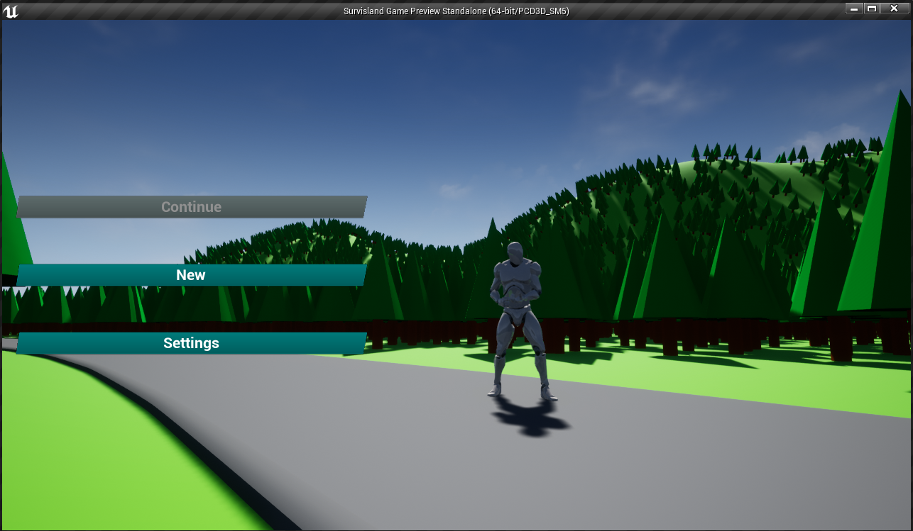  
*Das Hauptmenü | 'Continue' ist ausgegraut, wenn noch kein Spiel gespeichert wurde*   

Wir haben mit der Implementierung eines UserInterfaces begonnen. Unserem Plan nach soll es ein Hauptmenü geben, dass dem Spieler die Möglichkeit gibt ein neues Spiel zu starten oder ein bestehenden Spielstand fortzusetzen. Außerdem soll es ein Fenster mit einigen Einstellungen geben.
Während des eigentlichen Spielgeschehens soll lediglich eine Anzeige existieren, die den derzeitigen Status des Spielers anzeigt, also die derzeitige Anzahl an Hitpoints, Durst, Hunger und wie viel Gewicht der Spieler mit sich rumträgt. Wir haben zwar noch nicht mit dem Bedürfnissystem begonnen, allerdings werden wir schonmal das Layout erstellen.   
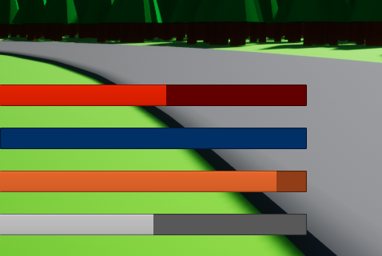    
*Die Status-Anzeige in der linken, unteren Ecke des Bildschirms*   
</details>

### September   
<details>
<summary>Anzeigen</summary>

**11. September**
Heute haben wir uns vollkommen auf den Spieler konzentiert. Wir haben den Kamerawechsel zwischen First- und ThirdPerson-Kamera implementiert und mit dem Bedürfnissystem begonnen.
Anschließend haben wir die Variablen des Bedürfnissystems mit den Werten der Statusleisten verknüpft, sodass diese jetzt dauerhaft aktualisiert werden.


**12. September**   
Heute haben wir ein Tool erstellt, mit dem wir ganz einfach Häuser generieren lassen können.
Dafür verwenden wir hauptsächlich ein InstancedStaticMeshComponent. Der Vorteil von diesen instanzierten Static-Meshes ist, dass alle Instanzen eines `UInstancedStaticMeshComponent` einen einzigen Drawcall teilen, d.h. wir beanspruchen weniger Leistung.  
Darüberhinaus haben wir mithilfe einer dynamischen Material-Instance eine Funktion gebaut, die das generierte Haus in einer zufälligen Farbe tönt, um für etwas Abwechslung zu sorgen.

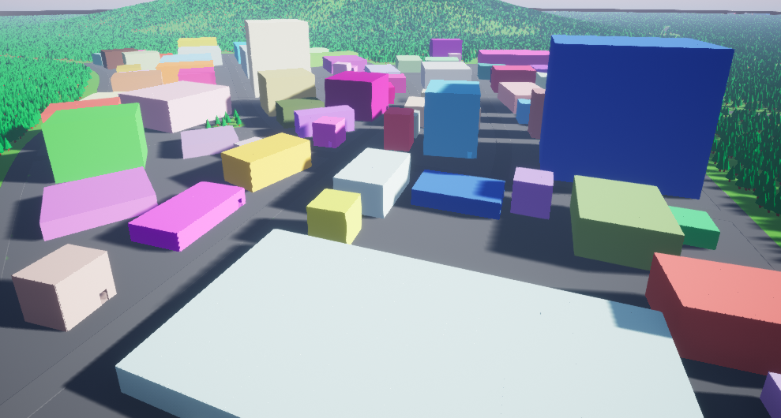   
*Eine kleine Stadt, die mit dem BuildingSpawner erstellt wurde*   

**24. September**  
Nachdem wir bereits unsere Gebäude erstellen können, wollen wir uns nun um die Straßen kümmern.
Wir basieren das Tool auf den [Splines](https://docs.unrealengine.com/en-US/API/Runtime/Engine/Components/USplineComponent/index.html). Das sind im Prinzip Kurven, deren Punkte sich verschieben lassen.
   
*Beispiel-Spline*   

Mithilfe des [`USplineMeshComponent`](https://docs.unrealengine.com/en-US/API/Runtime/Engine/Components/USplineMeshComponent/index.html) können wir ein StaticMesh so deformieren, dass es sich an die Eigenschaften der Splines anpasst.

   
*Das fertige RoadTool im Einsatz*   

Die gesamte Funktion ist dabei simpler als sie auf den ersten Blick wirkt:
Für jeden Punkt der Spline wird ein Mesh generiert und der Transform des aktuellen Spline-Punktes auf das Mesh übertragen.

```c++
void AStreet::UpdateMesh()
{
	if(MeshReference)
	{
		// Length of one UStaticMeshComponent
		float Spacing = MeshReference->GetBounds().BoxExtent.X * 2;

		float Remainder;
		int32 NumberOfMeshes = UKismetMathLibrary::FMod(Spline->GetNumberOfSplinePoints(), Spacing, Remainder);
		for(int i = 0; i <= NumberOfMeshes; i++)
		{
			USplineMeshComponent* NewSplineMesh = NewObject<USplineMeshComponent>();
			NewSplineMesh->SetStaticMesh(MeshReference);

			FVector StartPosition = Spline->GetLocationAtDistanceAlongSpline(i*Spacing, ESplineCoordinateSpace::Local);
			FVector EndPosition = Spline->GetLocationAtDistanceAlongSpline(i*Spacing+Spacing, ESplineCoordinateSpace::Local);
			FVector StartTangent;
			FVector EndTangent;
			if(NumberOfMeshes == i)
			{
				StartTangent = Spline->GetLocationAtDistanceAlongSpline(i*Spacing, ESplineCoordinateSpace::Local) * EndTangentLength;
				EndTangent = Spline->GetLocationAtDistanceAlongSpline(i*Spacing+Spacing, ESplineCoordinateSpace::Local) * EndTangentLength;
			}
			else
			{
				StartTangent = Spline->GetLocationAtDistanceAlongSpline(i*Spacing, ESplineCoordinateSpace::Local) * TangentLength;
				EndTangent = Spline->GetLocationAtDistanceAlongSpline(i*Spacing+Spacing, ESplineCoordinateSpace::Local) * TangentLength;
			}
			NewSplineMesh->SetStartAndEnd(StartPosition, StartTangent, EndPosition, EndTangent ,false);
			FVector2D StartScale = FVector2D(Spline->GetScaleAtDistanceAlongSpline(i*Spacing).X, Spline->GetScaleAtDistanceAlongSpline(i*Spacing).Y);
			NewSplineMesh->SetStartScale(StartScale, false);
			FVector2D EndScale = FVector2D(Spline->GetScaleAtDistanceAlongSpline(i*Spacing+Spacing).X, Spline->GetScaleAtDistanceAlongSpline(i*Spacing+Spacing).Y);
			NewSplineMesh->SetEndScale(EndScale, false);
			NewSplineMesh->UpdateMesh();
		}
	}
}
```
*Aus [AStreet](https://gitlab.com/f2p-entertainment/other/informatik-projekte/survisland/survisland/blob/master/Source/Survisland/Decoration/Street.cpp)*   

Zusätzlich haben wir uns noch zwei Funktionen eingebaut, die uns entweder eine neue Instanz des RoadTools am letzten Punkt der Spline spawnt, oder ein von uns ausgewähltes StaticMesh.
Da die Neuberechnung der Spline-Meshes vergleichsweise Resourcenaufwendig ist, kann es bei langen Splines zu Performanceproblemen innerhalb des Editors kommen. Mit unserer SpawnEndActor-Funktion können wir also einfach ein neues RoadTool am Ende der aktuellen Spline spawnen. Da wir mit `GetTransformAtSplinePoint` den Transform des letzten Punktes gleich auf des neue Tool anwenden ist der Anschluss der beiden Meshes zueinander perfekt.

**25. September & 26. September**  
Die restlichen Stunden im September haben wir am Inventar-System gearbeitet und das Datenmodell hinter den Items und dem Inventar angelegt.

</details>

### Oktober
<details>
<summary>Anzeigen</summary>   

**1. Oktober**  
Heute haben wir einen Actor erstellt, der aussieht wie ein Baum. Dafür verwenden wir einfach zwei Static-Meshes, die wir übereinander platzieren. Das eine Mesh ist ein einfacher Zylinder, der den Baumstamm darstellt, das andere ist eine Pyramide, die die Baumkrone darstellt.
Für eine größere Abwechslung sorgt eine zufällige Rotation um die eigene Achse.
```c++
    [...]
    FRotator RandomRotation = UKismetMathLibrary::RandomRotator();
	SetActorRotation(RandomRotation);
    [...]
```
*Zufällige Rotation durch [UKismetMathLibrary::RandomRotator](https://docs.unrealengine.com/en-US/API/Runtime/Engine/Kismet/UKismetMathLibrary/RandomRotator/index.html) | Aus [Tree.cpp](https://gitlab.com/f2p-entertainment/other/informatik-projekte/survisland/survisland/blob/master/Source/Survisland/Decoration/Tree.cpp#L29)*

Darüberhinaus haben wir uns den Baum als sogenannten Foliage-Type konfiguriert. So können wir das [Foliage Tool]() der Engine verwenden, um eine große Anzahl an Bäumen, ähnlich wie beim Verändern oder Färben des Landscapes, zu platzieren.
So können wir die etwa Bäume problemlos auf der ganzen Map verteilen.   
   
*Das Foliage-Tool im Einsatz*

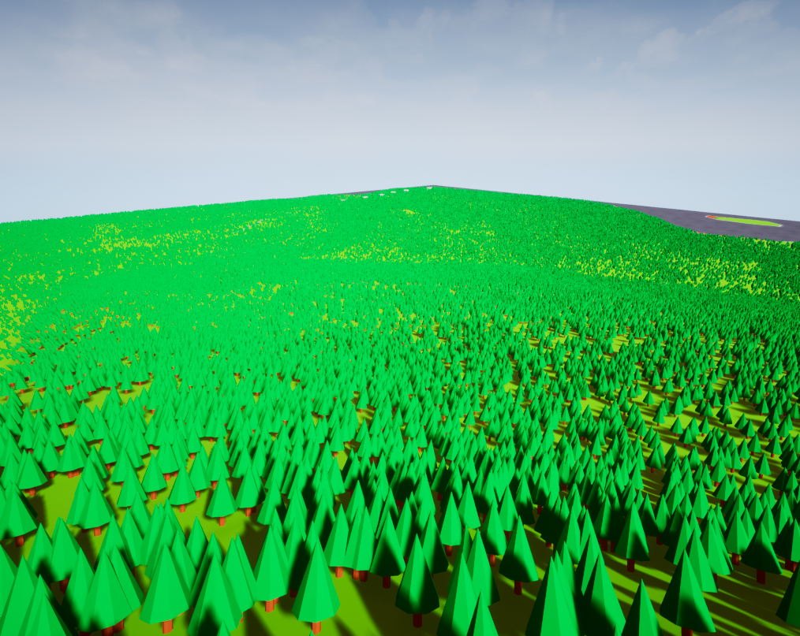   
*Bäume auf der Map*

**2. Oktober**

Heute haben wir implementiert, dass der Spieler mit gespawnten Items interagieren kann, bzw. diese zu seinem Inventar hinzufügen kann.

**19. Oktober**

Wir haben ein simples User-Interface erstellt, in dem der Spieler seine Items verwenden kann.

**20. Oktober**

Da der Spieler nun in der Lage ist mit gesammelten Items dem Hunger und Durst entgegenzuwirken, haben wir einen Timer implementiert, der in regelmäßigen Abständen das Sättigungslevel des Spielers senkt.

**Verbleibender Oktober**   
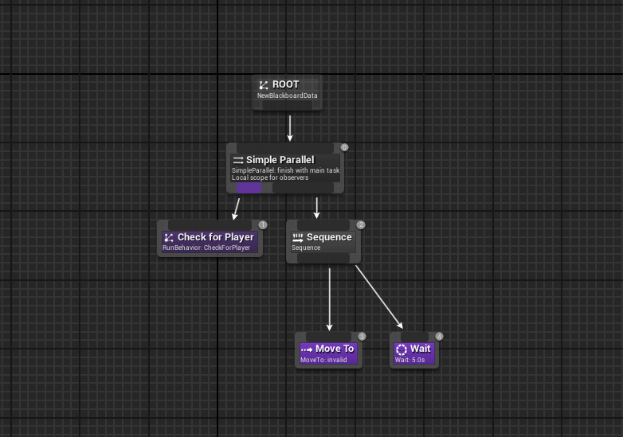   
*Ein Teil der Logik hinter der KI*   

Den Rest des Oktobers haben wir hauptsächlich an der KI gearbeitet. Die NPCs sind nun schwarze Figuren, die, wie der Spieler auch, mit einem Halbautomatischen Gewehr ausgestattet sind.
Genau wie die Items in der Welt, werden auch die NPCs nach Ablauf eines Timers an zufälligen Orten neu-gespawnt.

Befinden sich die NPCs in einer Stadt, können sie sich entweder dauerhaft in Gebäuden aufhalten, oder durch die Straßen der Region ziehen. NPCs, die entlang einer der Straßen im Wald gespawnt werden, laufen lediglich einige Meter auf und ab.

Beide NPC-Typen verfolgen den Spieler, wenn er in ihre Nähe kommt und vesuchen ihn zu erschießen.
Die Treffer sind dabei komplett zufällig. 

</details>

### November  
<details>

<summary>Anzeigen</summary>

In der Zeit im November bis zur Abgabe haben wir die Karte finalisiert und einige Play-Tests durchgeführt. Darüberhinaus haben wir die Dokumentation erweitert in den letzen Tagen an `survisland.de` gearbeitet.

[Link zur Website](https://survisland.de)

[Link zum Repository](https://gitlab.com/f2p-entertainment/other/informatik-projekte/survisland/survisland.de)

#### Bilder der finalen Map
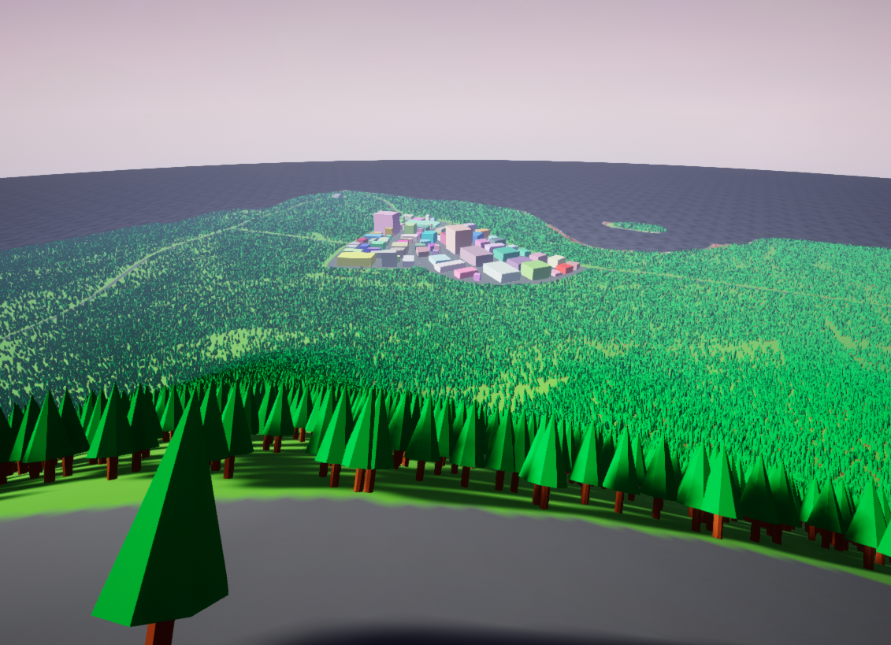      
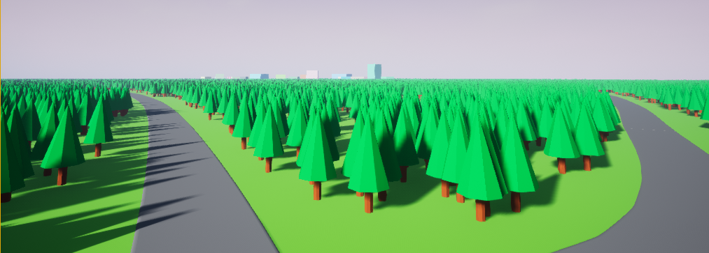    
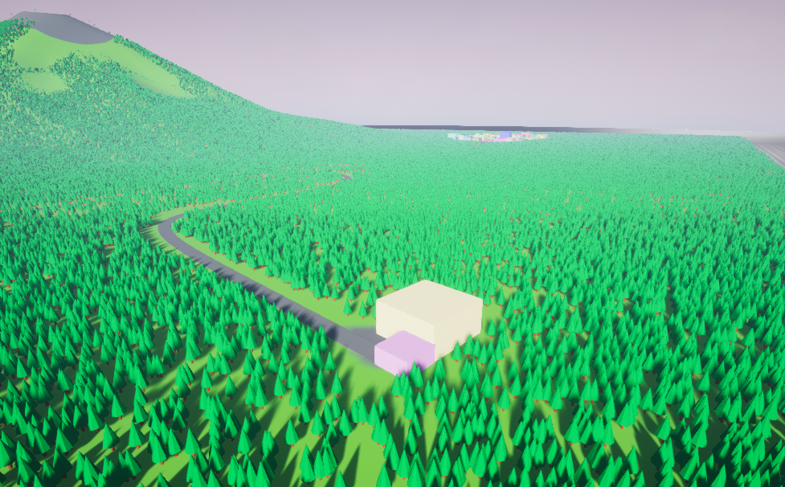     


</details>

## Nachwort

Der Abgabetermin ist gekommen. Zeit einen Blick auf den aktuellen Stand des Projekts zu werden und ein Fazit zu ziehen.

### Die Map

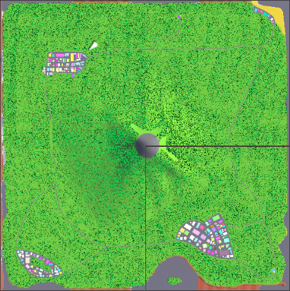   
*Die Minimap des World-Composition-Tools zum Zeitpunkt der Abgabe*   

Wir sind sehr zufrieden wie sich die Karte entwickelt hat. Wir sind zwar nicht über die Größe hinausgekommen, mit der wir ursprünglich begonnnen hatten, allerdings wird beim Spielen klar, dass vor einem Ausbau der Karte ein Ausbau der Spieltiefe stattfinden müsste.

### Spielmechaniken

Mit Blick auf unser Konzept haben wir alle der Gameplay-Features, die wir auch im Spiel haben wollten umgesetzt. Wir haben zwar keines der optionalen Features im zeitlichen Rahmen umsetzen können, sind aber dennoch sehr zufrieden mit dem Ergebnis.

### Zukunft

`Survisland` hat sich als ein interessantes Projekt erwiesen, das wir mit Sicherheit in Zukunft fortführen werden! Der git-Tag `Informatik-Abgabe` markiert den Zustand am Tag der Abgabe.

Die aktuellste Version kann stets auf https://downloads.survisland.de/latest heruntergeladen werden